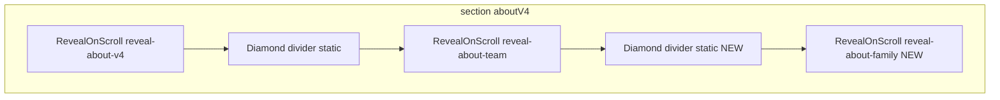

# Family / history section in About (phased plan)

## Reconnaissance summary (evidence-based)

| Topic           | Finding                                                                                                                                                                                                                                                                                                                                                                                                                                 |
| --------------- | --------------------------------------------------------------------------------------------------------------------------------------------------------------------------------------------------------------------------------------------------------------------------------------------------------------------------------------------------------------------------------------------------------------------------------------- |
| Insertion point | Only append **after** the closing `</RevealOnScroll>` of the team block (after line 165 in `[components/sections/AboutSection.tsx](components/sections/AboutSection.tsx)`), before `</section>`. Do not change lines 1–165.                                                                                                                                                                                                             |
| Diamond divider | Exact markup to copy is lines 90–94: `aboutV4DiamondDivider` → `aboutV4DiamondLine` / `aboutV4Diamond` / `aboutV4DiamondLine` (`[components/sections/AboutSection.tsx](components/sections/AboutSection.tsx)`). Styles live in `[components/sections/AboutSection.css](components/sections/AboutSection.css)` (lines 75–94).                                                                                                            |
| CSS variables   | `[app/globals.css](app/globals.css)` defines `--background`, `--foreground`, `--gold` (#d4af37). The About section already mixes `var(--gold)` with literal `rgba(201, 146, 10, …)` and `#c9920a`—keep that pattern per your constraints.                                                                                                                                                                                               |
| Fonts           | Not `tailwind.config.ts`—project uses **Tailwind v4** with `@theme inline` in globals; display/body fonts come from Next fonts in `[app/layout.tsx](app/layout.tsx)`: `--font-montserrat`, `--font-cormorant`. `[AboutSection.css](components/sections/AboutSection.css)` already uses `var(--font-montserrat)` / `var(--font-cormorant)` with fallbacks.                                                                               |
| Scroll reveal   | `[components/RevealOnScroll.tsx](components/RevealOnScroll.tsx)` exists; team uses `className="reveal-about-team"` with stagger rules in `[AboutSection.css](components/sections/AboutSection.css)` (`.reveal-about-team …`). Mirror this with a **new** class e.g. `reveal-about-family` so team rules stay untouched.                                                                                                                 |
| Images          | Workspace listing under `public/images/aboutus/` currently shows only `onama.webp`, while the team block already references `/images/aboutus/osnivac.webp` and `/images/aboutus/menadzer.webp`. **Plan to add** `stojan.webp` (or `.jpg`) for the first generation portrait and ensure all three files exist in `public/images/aboutus/` for production; implement **Image `onError` → initials fallback** (SS / BS / BS) as specified. |

---

## Phase 1 — Structure and TSX (append-only)

**Goal:** Add the divider + family wrapper in `[AboutSection.tsx](components/sections/AboutSection.tsx)` only at the bottom of the section.

1. **Top separator (between team and family):** Paste the **same** diamond block as lines 90–94 (`aboutV4DiamondDivider` + children), placed **immediately after** the team `</RevealOnScroll>`.
2. **Family wrapper:** Open `<RevealOnScroll className="reveal-about-family" once>` wrapping everything below until the family content ends (see step 3).
3. **Inside the reveal:**

- Outer container (new class, e.g. `aboutV4Family`) with `aria-labelledby` pointing to a new family title `id` (e.g. `about-family-surname`).
- **Header:** two eyebrow lines, `h3` “Stanković”, gold bar (reuse sizing pattern from `aboutV4TeamBar` but per spec: 44×2px, centered; new class to avoid changing team).
- **Portraits row:** three columns in order Stojan | sep | Bojan | sep | Bogdan. Use semantic structure (`section` or `div` + `article` per portrait) with data from your spec (generation, role, era, names).
- **Story block:** label row (“Naša priča” + extending line) + five paragraphs exactly as provided (`<strong>`, `<em>` with styles in CSS).
- **Closing diamond:** duplicate the same `aboutV4DiamondDivider` markup; add a wrapper class if you need `margin-top: 40px` without affecting other dividers.

1. **Images:** Use `next/image` with sizes appropriate to avatar dimensions; for each portrait, implement **error fallback** (client state: `onError` → show initials layer, hide broken image) so missing files still look acceptable.
2. **Constraints:** No edits above the new block; no new npm packages; no `box-shadow`; gold via `var(--gold)` where solid; `rgba(201,146,10,…)` only where opacity gradients require it.

---

## Phase 2 — Styles in AboutSection.css

**Goal:** All layout/typography/responsive/reveal for family lives in `[components/sections/AboutSection.css](components/sections/AboutSection.css)` with a dedicated prefix (e.g. `aboutV4Family`*, `aboutV4FamilyPortrait`*) so existing `.aboutV4Team\`and`.reveal-about-team` rules are unchanged.

1. **Outer block:** `padding: 100px 80px 110px`, `background: transparent` (inherits page `#0a0805`).
2. **Header:** Montserrat eyebrows (10px, letter-spacing 0.28em), second line color `rgba(201,146,10,0.4)`; title Cormorant 68px / 700 / italic; gold bar 44×2px; header `margin-bottom: 88px`.
3. **Portraits:** Flex row, `gap: 64px`, `margin-bottom: 80px`; column `flex-col`, `align-items: center`, `gap: 22px`; side columns `opacity: 0.78`, center full opacity. Avatar wrapper: **single** ring via `::before` (`inset: -6px`, `border-radius: 50%`, `border: 1px solid rgba(201,146,10,0.22)`)—align with spec (team currently uses two rings; family should follow the **single ring** spec). Inner circle bg `#1a1208`; sizes **176 / 136 / 136** for main/side; gold dot 12×12, `bottom: 5px; right: 5px`, border `#0a0805`. Vertical separators: 1×60px gradient, `flex-shrink: 0`, `margin-bottom: 22px` for optical alignment.
4. **Story:** `max-width: 720px`, `margin: 0 auto`; label row flex + line; body Montserrat 15px / 300 / line-height 2, color `#7a7068`; `p` spacing; `strong` → `var(--gold)`, `font-weight: 400`; `em` → Cormorant italic 17px, `#b0a080`.
5. **Reveal animation — new block `.reveal-about-family`:** Mirror the team pattern (initial hidden states + `.is-visible` transitions, `0.7s`, `cubic-bezier(0.22, 1, 0.36, 1)`). Apply stagger to **targeted child classes** (not generic tags): header group delay `0.1s`, gold bar `0.2s` + `scaleX(0)→1` with `transform-origin: center` (centered bar), three columns `0.3s / 0.45s / 0.6s` with `translateY(24px)`, story label `0.5s`, story body `0.6s` with `translateY(16px)`. Duplicate `**prefers-reduced-motion` overrides like `.reveal-about-team`.
6. **Responsive:**

- **640px–1023px:** padding `72px 40px 80px`, title `52px`, row gap `32px`, avatars `152` / `120` / `120`, separators height `48px`.
- **<640px:** padding `56px 24px 72px`, title `42px`, column flex-direction, gap `40px`, hide vertical separators, add **horizontal** gradient separators (`60px × 1px`, `linear-gradient(to right, …)`), all avatars `136×136`, side opacity `1`, story `14px` / `line-height: 1.9`.

---

## Phase 3 — Assets and verification

1. **Assets:** Add `public/images/aboutus/stojan.webp` (or agreed filename) and confirm `osnivac.webp` / `menadzer.webp` are present in the deployment folder (they are already referenced by the team block).
2. **Quick checks:** Build passes; no console errors from Image; reduced-motion shows static final state; visual match to spacing spec on desktop/tablet/mobile.

---

## Files to touch (minimal set)

| File                                                                           | Action                                                        |
| ------------------------------------------------------------------------------ | ------------------------------------------------------------- |
| `[components/sections/AboutSection.tsx](components/sections/AboutSection.tsx)` | Append divider + `RevealOnScroll` + family markup only.       |
| `[components/sections/AboutSection.css](components/sections/AboutSection.css)` | Add family + `reveal-about-family` rules + media queries.     |
| `[public/images/aboutus/](public/images/aboutus/)`                             | Add Stojan portrait (+ verify other two files exist locally). |

No changes to `[app/globals.css](app/globals.css)` unless you prefer centralizing one shared keyframe (optional; not required if transitions-only like team).