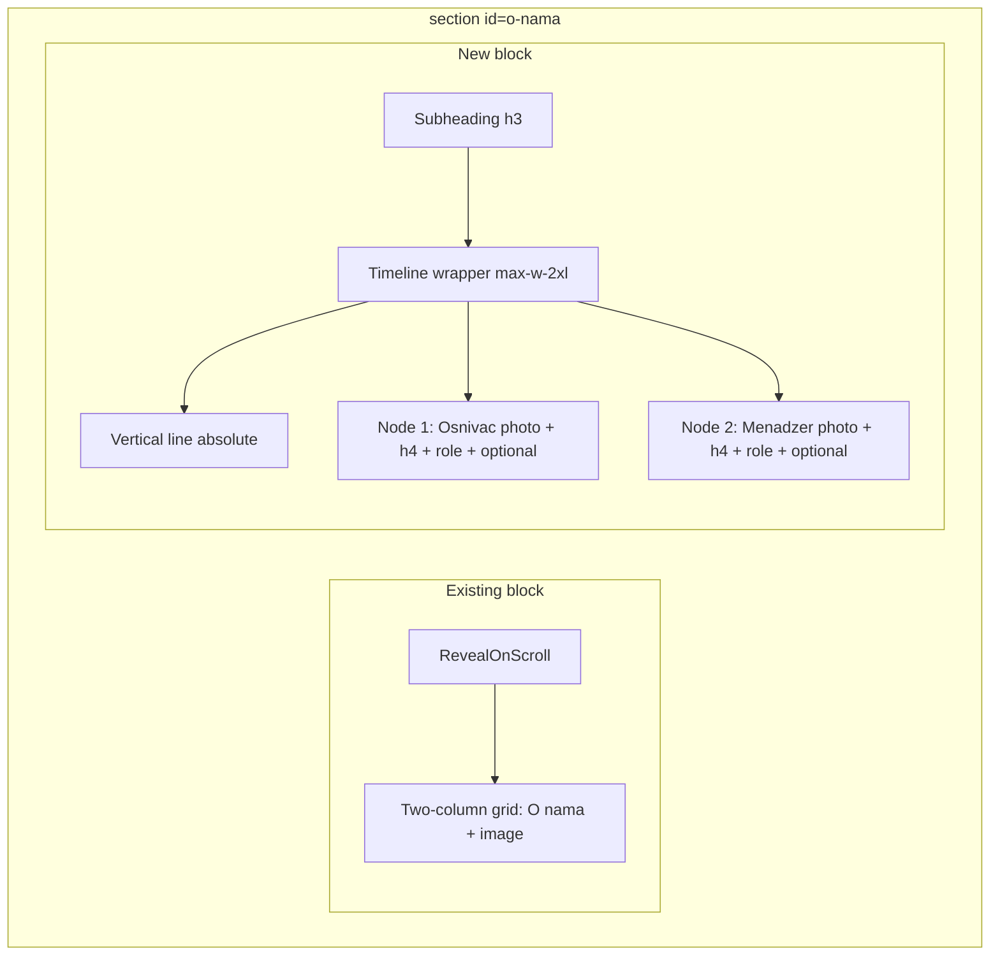

# About Team Vertical Timeline – Implementation Plan

## Current state

- **[components/About.tsx](components/About.tsx):** Single `<section id="o-nama">` with one `RevealOnScroll` wrapping a `max-w-7xl` div and a two-column grid (title "O nama", paragraphs, main image). No team block yet.
- **[app/globals.css](app/globals.css):** `revealFadeUp` (56px) for generic `.reveal-on-scroll`; `.reveal-about` uses child animations (`aboutSlideRight` / `aboutFadeUp`). `prefers-reduced-motion` already respected.
- **Images:** [public/images/aboutus/](public/images/aboutus/) contains `osnivac.webp`, `menadzer.webp`, `onama.webp` — paths match spec.

## 1. Structure in About.tsx

- **Leave the first block unchanged:** existing `RevealOnScroll` with the two-column grid (O nama + image).
- **Add a second block** inside the same `<section id="o-nama">` and the same outer container (`mx-auto max-w-7xl px-4 sm:px-6 lg:px-8`):
  - Optional subheading: `<h3>Tim koji stoji iza projekta</h3>` (same scale as other subheadings, e.g. `text-2xl font-semibold`).
  - Wrapper: `max-w-2xl mx-auto mt-16 sm:mt-20 lg:mt-24` for the timeline column.
  - Optionally wrap this whole second block (subheading + timeline) in a second `<RevealOnScroll>` for scroll-in (see Reveal below).

**DOM shape:** Keep one `max-w-7xl` div; inside it, after the grid, add the subheading and the timeline wrapper. No new files; single-file implementation in About.tsx.

## 2. Timeline layout (Tailwind)

- **Outer column:** Centered `max-w-2xl mx-auto`, padding consistent with section.
- **Vertical line:** Absolute line full height of the two nodes. Example: `absolute left-5 top-0 bottom-0 w-0.5 bg-white/20` (or `left-[1.25rem]`). Line runs behind the node markers; content uses `pl-12` (or `pl-10` / `pl-8` on small screens) so text sits to the right.
- **Nodes (x2):** Each node is an `<article>` with:
  - **Marker:** Circular photo overlapping the line — `absolute left-0` with sizing so center aligns with line (e.g. `w-20 h-20` or `w-16 h-16 sm:w-20 sm:h-20`), `rounded-full overflow-hidden`, positioned so it sits on the line (e.g. `-translate-x-1/2` if using left in rem, or `left-[calc(1.25rem-2.5rem)]` so center is on the line).
  - **Content to the right:** Name (`<h4>`), role (`
`), optional one-line description.
  - **Spacing:** `relative pl-12 pb-12` (or `pb-16`) per article; last node has no or minimal bottom padding so the line does not hang.
- **Photos:** `next/image` with fixed width/height (e.g. 80 or 96px), `rounded-full object-cover`. Alt: "Osnivač Meden Srbija", "Menadžer Meden Srbija". Src: `/images/aboutus/osnivac.webp`, `/images/aboutus/menadzer.webp`.
- **Order:** First node = Osnivač, second = Menadžer.

## 3. Styling (Tailwind, dark theme)

- Reuse tokens: `text-[var(--foreground)]`, `text-[var(--foreground)]/85`, `text-[var(--foreground)]/70`.
- **h3:** `text-2xl font-semibold text-[var(--foreground)]` (and optional margin below).
- **Name (h4):** `text-xl font-semibold text-[var(--foreground)]`.
- **Role:** `text-sm text-[var(--foreground)]/70`.
- **Line:** `bg-white/20` or `bg-white/15`.
- **Responsive:** Line position tied to photo center (e.g. `left-5` for 20px line center when photo is 80px and offset by half). On small screens: `pl-8` or `pl-6`; photo `w-16 h-16 sm:w-20 sm:h-20` if desired.

## 4. Reveal animation (optional)

- **Option A:** Wrap the timeline block (h3 + timeline wrapper) in `<RevealOnScroll>` with no `className`. The wrapper gets default `reveal-on-scroll` and will use existing `revealFadeUp` (56px) when visible — no globals.css change.
- **Option B:** Add a class e.g. `reveal-timeline` in [app/globals.css](app/globals.css) reusing `aboutFadeUp` (40px) so the timeline motion matches the About text, and pass `className="reveal-timeline"` to RevealOnScroll. In that case, define `.reveal-on-scroll.reveal-timeline.is-visible { animation: aboutFadeUp ... forwards; }` and set initial opacity/transform like other reveal elements; respect `prefers-reduced-motion` (opacity 1, transform none, no animation).

## 5. Accessibility and SEO

- One `<h3>` for "Tim koji stoji iza projekta"; each person’s name as `<h4>` (only h4s in this section).
- Images: descriptive alt "Osnivač Meden Srbija", "Menadžer Meden Srbija".
- Section remains one `<section id="o-nama">` with `aria-labelledby="about-title"`; no change to landmark.

## 6. Copy (placeholders)

- Subheading: "Tim koji stoji iza projekta".
- Node 1: role "Osnivač"; optional line "Ideja i vizija brenda."
- Node 2: role "Menadžer"; optional line "Svakodnevno vođenje i kvalitet."
- Names: omit or use only role as visible title; names can be added later.

## 7. Files to touch

| File                                         | Change                                                                                                                                                                                                                            |
| -------------------------------------------- | --------------------------------------------------------------------------------------------------------------------------------------------------------------------------------------------------------------------------------- |
| [components/About.tsx](components/About.tsx) | Add timeline subsection below the grid inside the same `max-w-7xl` container: subheading, timeline wrapper, absolute line, two `<article>` nodes with `next/image`, h4, role, optional line. Optionally wrap in `RevealOnScroll`. |
| [app/globals.css](app/globals.css)           | Only if using Option B: add `.reveal-timeline` using `aboutFadeUp` and `prefers-reduced-motion` override.                                                                                                                         |

## 8. Verification

- Images load from `/images/aboutus/osnivac.webp` and `/images/aboutus/menadzer.webp`.
- Timeline order: Osnivač then Menadžer.
- Dark theme and typography match the rest of the About section.
- No layout shift: use explicit width/height on `Image` (e.g. 80x80 or 96x96).
- Run app and check responsive behavior and `prefers-reduced-motion: reduce`.
