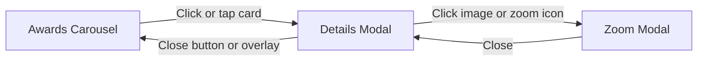

# Awards Section Redesign – Carousel, Modal, Zoom

## Current state (reconnaissance)

- **[components/Awards.tsx](components/Awards.tsx):** Custom CSS-based carousel (no library). Only the center slide is “active”; hover on center slide opens a floating **AwardHoverPanel** (positioned by anchor rect). No click-to-open path; mobile has no way to see award details.
- **[components/AwardHoverPanel.tsx](components/AwardHoverPanel.tsx):** Hover-only panel (portal) with image + text; image click opens **ImageLightbox** for zoom. Uses `createPortal`, no focus trap.
- **[components/ImageLightbox.tsx](components/ImageLightbox.tsx):** Full-screen lightbox with optional magnifying lens (CSS background trick), Escape to close, body scroll lock. Uses native ``. No pinch-to-zoom or focus trap.
- **Award type:** `{ src, alt, name, longDescription }`. Single image URL; no thumbnail/modal/zoom variants.
- **Stack:** Next 16, React 19, Tailwind v4. No carousel library; no focus-trap library. Theme: `--background: #0a0a0a`, `--gold: #d4af37` in [app/globals.css](app/globals.css).
- **Assets:** Six awards under `public/images/awards/` (e.g. `Diploma2025.webp`, `nagradaOskar.webp`, …). Use as single source for now; optional later: thumbnail/modal/zoom variants.

## Target interaction flow



- **Desktop:** Hover on card can show a subtle preview (optional); **click** opens Details Modal. In modal, click image or zoom icon opens Zoom Modal.
- **Mobile:** No hover; **tap** card opens Details Modal; tap image/zoom icon opens Zoom Modal. Pinch/double-tap in Zoom.

## Architecture and file changes

| Area                | Action                                                                                                                                                                                                                                                                            |
| ------------------- | --------------------------------------------------------------------------------------------------------------------------------------------------------------------------------------------------------------------------------------------------------------------------------- |
| **Carousel**        | Replace custom track with **Embla Carousel** (lightweight, touch, a11y, no jQuery). Alternative: Swiper (more features, larger bundle).                                                                                                                                           |
| **Section header**  | In-place in Awards: new heading/subtitle styles + gold accent line per spec.                                                                                                                                                                                                      |
| **Award cards**     | New card UI inside carousel: container (#0d0d0d, gold border, 16px radius), image + caption below; hover lift/scale desktop-only; **onClick** opens Details Modal (no hover dependency for primary action).                                                                       |
| **Details Modal**   | New component **DetailsModal** (or **AwardDetailsModal**): portal, overlay (blur, click to close), centered container (max 900px), two-column (image left, details right) on desktop, stack on mobile; zoom icon overlay on image; close button top-right; focus trap and Escape. |
| **Zoom Modal**      | Reuse and extend **ImageLightbox**: ensure it works when opened from Details Modal (z-index 2000 > Details 1000); add focus trap and return-focus; optionally add **react-zoom-pan-pinch** (or similar) for pinch/double-tap on mobile.                                           |
| **Award data**      | Extend `Award` type with optional `image?: { thumbnail?, modal?, zoom? }`; fallback to single `src` for backward compatibility.                                                                                                                                                   |
| **AwardHoverPanel** | Remove from main flow. Optional: keep a small “hover preview” (e.g. tooltip or compact card) on desktop only; spec allows “hover popup” as secondary.                                                                                                                             |

## Section-by-section implementation

### 1. Page header (inside Awards)

- **Heading:** “Nagrade i kvalitet” — 48–56px desktop, 36–40px mobile, font-weight 700, center, color #ffffff, margin-bottom 24px.
- **Subtitle:** Keep current copy; 18–20px desktop, 16–17px mobile, line-height 1.7, #c0c0c0, max-width 800px, center, margin-bottom 60–80px.
- **Accent:** Thin gold line under heading: 60–80px wide, centered, 3px height, #D4AF37.

All in the same section wrapper; use Tailwind + one small utility in [app/globals.css](app/globals.css) if needed for the line.

### 2. Carousel (Embla)

- **Container:** max-width 1400px, center, padding 60px 20px, position relative.
- **Slides:** Desktop 3 with peek; tablet 2; mobile 1 with 20–30px peek. Gap 32–40px desktop, 20px mobile. Infinite loop, optional autoplay 5–6s (disable on mobile per spec). Transition ~0.4s ease.
- **Cards:** Per spec (background #0d0d0d or rgba(255,255,255,0.05), border rgba(212,175,55,0.3), radius 16px, padding 24–32px). Hover: translateY(-8px) scale(1.02), stronger border/shadow, z-index 10. Cursor pointer. Image: 100% width, contain, 8px radius; caption below (18–20px, weight 600, #D4AF37).
- **Arrows:** Absolute left/right; desktop outside container, mobile overlaid. 48–56px circle, gold border/background rgba(212,175,55,0.2), hover #D4AF37 fill; min 44px for touch.
- **Dots:** Below carousel, centered, 10–12px inactive, 14px active #D4AF37, 32px min touch target.

Implement in [components/Awards.tsx](components/Awards.tsx): integrate Embla, render new card component (or inline), wire `onClick` to open Details Modal with `selectedAward`.

### 3. Details Modal (new component)

- **Trigger:** Card click/tap (and optionally “Open” from hover preview if kept).
- **Overlay:** fixed, full viewport, rgba(0,0,0,0.85), backdrop-filter blur(8px), z-index 1000, click to close.
- **Container:** max-width 900px, max-height 90vh, #0d0d0d/#1a1a1a, 2px gold border, 20px radius, padding 40–48px desktop / 24–32px mobile, centered, slide-up animation (e.g. 0.4s cubic-bezier).
- **Layout:** Desktop two-column (image ~50–55%, details ~45–50%, gap 40px); mobile single column (image then details, gap 24px).
- **Image:** Border-radius 12px, cursor zoom-in, relative. **Zoom icon overlay:** top-right, 40–44px circle, gold bg/border; click opens Zoom Modal.
- **Details:** Title (28–32px / 24–26px mobile, #D4AF37), subtitle/category, description paragraphs (16–17px, #c0c0c0), closing statement (italic, #D4AF37). Parse `longDescription` into paragraphs (existing logic in AwardHoverPanel).
- **Close:** Top-right, 40–44px circle, border only, X icon; hover rotate 90deg. Body scroll lock, Escape, focus trap (reuse pattern from [components/ProductHoverPanel.tsx](components/ProductHoverPanel.tsx) lines 46–102), return focus to trigger on close.

New file: e.g. `components/AwardDetailsModal.tsx`. Awards passes `selectedAward`, `onClose`, and `onOpenZoom(imageSrc, alt)`.

### 4. Zoom Modal (extend ImageLightbox)

- **When to use:** Opened from Details Modal (image or zoom icon click). Must sit above Details Modal: z-index 2000.
- **Enhancements:**
  - Focus trap and return focus to Details Modal (or trigger) on close.
  - Optional: **react-zoom-pan-pinch** (or similar) for pinch-to-zoom and double-tap on mobile; keep existing lens as optional “magnifier” for desktop.
  - High-res image: use same `src` for now; later pass `image.zoom` from Award if available.
- **Styling:** Align with spec (e.g. 95vw/95vh container, white bg for certificate, 48px close button).
- Keep: Escape, backdrop click, body scroll lock, role="dialog", aria-label.

Refactor [components/ImageLightbox.tsx](components/ImageLightbox.tsx) to accept optional `zIndex`, `returnFocusRef`, and optionally integrate a small zoom/pan library for touch. AwardHoverPanel currently opens ImageLightbox; Details Modal will open the same component (or a thin wrapper) with the new props.

### 5. Mobile-specific

- Carousel: 1 slide, peek, no hover; swipe enabled by Embla; arrows overlaid, min 44px; optional: disable autoplay.
- Modal: Full-screen or 90vw; stack layout; all interactive elements min 44x44px; prevent body scroll (already in ImageLightbox).
- Zoom: Pinch and double-tap via library; smooth exit; prominent close button.

### 6. Accessibility

- **Keyboard:** Tab through cards; arrow keys for carousel (Embla supports or add); Enter/Space on focused card opens Details Modal; Escape closes Details then Zoom; Tab trapped in open modal.
- **Screen reader:** Alt on images; aria-label on arrows/dots; `aria-live` for slide changes; `role="dialog"` and `aria-modal="true"` on both modals; focus management (trap + return).
- **Visual:** Use existing `--gold` and contrast; visible focus rings; respect `prefers-reduced-motion` in [app/globals.css](app/globals.css) for new animations.

### 7. Animations

- Carousel: 0.4s ease slide; card hover 0.3s; arrow/dot 0.2–0.3s.
- Details Modal: overlay fade 0.3s; container slide-up 0.4s cubic-bezier(0.16, 1, 0.3, 1).
- Zoom: image scale-in 0.3s; close 0.3s fade. Add `@media (prefers-reduced-motion: reduce)` overrides for new keyframes/transitions.

### 8. Data model

- In [components/Awards.tsx](components/Awards.tsx), extend type:

```ts
export type Award = {
  src: string;
  alt: string;
  name: string;
  longDescription?: string;
  subtitle?: string; // optional, e.g. "Zahvalnost pretočena u priznanje."
  image?: {
    thumbnail?: string;
    modal?: string;
    zoom?: string;
  };
};
```

- Keep existing `awards` array; add `subtitle` where needed. Use `image?.modal ?? src` and `image?.zoom ?? src` in modal/zoom when implementing.

## Dependencies

- **embla-carousel-react** (recommended): small, touch-friendly, a11y-friendly. Install + use in Awards.
- **Optional:** **react-zoom-pan-pinch** (or **medium-zoom**, **react-medium-image-zoom**) for pinch/double-tap in Zoom Modal. Evaluate bundle size; if skipped, keep current lens + native scroll for large images.

## File list

| File                                                             | Action                                                                                                                            |
| ---------------------------------------------------------------- | --------------------------------------------------------------------------------------------------------------------------------- |
| [components/Awards.tsx](components/Awards.tsx)                   | Major refactor: header, Embla carousel, new cards, state for selected award + modal open, render Details Modal.                   |
| `components/AwardDetailsModal.tsx`                               | **New:** Details modal (overlay, layout, image+zoom icon, details, close, focus trap, Escape).                                    |
| [components/ImageLightbox.tsx](components/ImageLightbox.tsx)     | Extend: optional zIndex (2000), returnFocusRef, optional pinch/double-tap (if library added).                                     |
| [components/AwardHoverPanel.tsx](components/AwardHoverPanel.tsx) | Remove from Awards render; optionally repurpose as desktop-only hover “preview” (small card/tooltip) that does not replace click. |
| [app/globals.css](app/globals.css)                               | Add any shared modal/carousel animation classes and reduced-motion overrides.                                                     |

## Implementation phases (priority)

**Phase 1 – Core**

1. Add Embla; implement carousel (3/2/1 slides, arrows, dots, responsive).
2. New award card UI with click handler → set `selectedAward` and open Details Modal.
3. Implement AwardDetailsModal (layout, image, details, zoom button, close, body scroll lock, Escape).
4. Wire Details Modal open/close and zoom button → open ImageLightbox.

**Phase 2 – Zoom**  
5. Ensure ImageLightbox works when opened from modal (z-index, focus return).  
6. Optional: add react-zoom-pan-pinch for mobile pinch/double-tap.  
7. High-res/zoom image URL from Award when available.

**Phase 3 – Polish**  
8. Section header (typography + gold line).  
9. All animations and reduced-motion.  
10. Keyboard nav (arrows in carousel, focus trap in both modals).  
11. ARIA and screen reader (labels, live region, focus management).

**Phase 4 – Optional**  
12. Magnifying lens in Zoom (already in ImageLightbox; keep or refine).  
13. Optional hover preview on desktop.  
14. Lazy load / srcset for carousel and zoom images.

## Testing checklist (from spec)

- Carousel: smooth slides, 3/2/1 breakpoints, arrows and dots, swipe on mobile.
- Cards: tappable on mobile; click opens Details Modal on all devices.
- Details Modal: correct content, zoom icon opens Zoom; close by button and overlay.
- Zoom: high-res image, pinch/double-tap on mobile, close returns to Details or page.
- Keyboard: Tab, Enter/Space, Escape; focus trap in modals.
- Screen reader: meaningful labels and live region.
- Performance: 60fps transitions; lazy images where applicable.

## Summary

- **Carousel:** Embla in Awards.tsx with new card design and responsive slides/dots/arrows.
- **Flow:** Card click → Details Modal → image/zoom click → Zoom Modal (ImageLightbox); no reliance on hover for primary path.
- **New component:** AwardDetailsModal (portal, two-column, zoom icon, focus trap).
- **Reuse:** ImageLightbox with z-index and focus-return for zoom; optional touch-zoom library.
- **Remove:** AwardHoverPanel from primary flow; optional desktop hover preview.
- **Data:** Optional `Award.subtitle` and `Award.image.{thumbnail,modal,zoom}` for future optimization.
