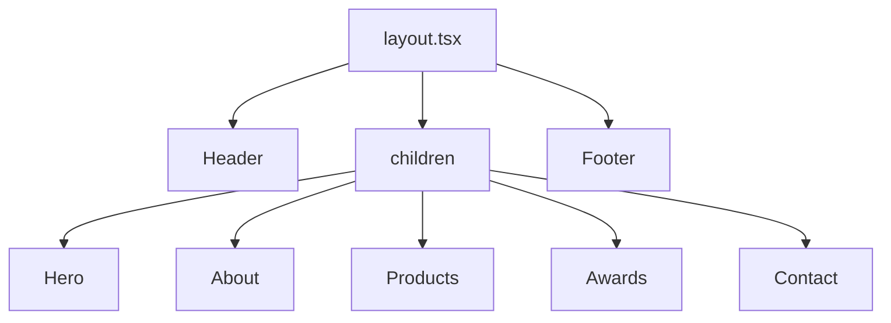

# Medensrbija – Context Recovery & Phase Status

## Spec and rules (locked in)

- **Framework:** Next.js App Router. **Styling:** Tailwind (already in use; stay consistent).
- **Assets:** All images under `public/images/`; reference as `/images/...`; use `next/image` except CSS backgrounds.
- **Theme:** Dark (from [.cursor/rules/meden-rules.mdc](.cursor/rules/meden-rules.mdc)).
- **Scope:** Static-first until Phase 6+; no CMS in early phases. Work **one phase at a time**; do not change earlier phases unless asked.

## Current codebase vs phases

| Phase | Goal                                                        | Status         | Evidence                                                                                                                                                                      |
| ----- | ----------------------------------------------------------- | -------------- | ----------------------------------------------------------------------------------------------------------------------------------------------------------------------------- |
| **0** | Project setup, layout, metadata, fonts, global styles       | Done           | [app/layout.tsx](app/layout.tsx): metadata "Meden Srbija", `lang="sr"`, Inter (Google Fonts). [app/globals.css](app/globals.css): dark theme, Tailwind, CSS vars.             |
| **1** | Header + Footer, sticky nav, mobile hamburger               | Done           | [components/Header.tsx](components/Header.tsx): logo left, nav right, sticky, hamburger; [components/Footer.tsx](components/Footer.tsx) used in layout.                       |
| **2** | Hero: background, h1, subheadline, CTA (scroll to products) | Done           | [components/Hero.tsx](components/Hero.tsx), [components/HeroBackground.tsx](components/HeroBackground.tsx); composed in [app/page.tsx](app/page.tsx).                         |
| **3** | About: two-column, tradition/quality, image                 | Done           | [components/About.tsx](components/About.tsx) in page.                                                                                                                         |
| **4** | Products grid, ProductCard, hover                           | Done           | [components/Products.tsx](components/Products.tsx), [components/ProductCard.tsx](components/ProductCard.tsx); optional [ProductHoverPanel](components/ProductHoverPanel.tsx). |
| **5** | Awards / quality, social proof                              | Done           | [components/Awards.tsx](components/Awards.tsx); optional [AwardHoverPanel](components/AwardHoverPanel.tsx).                                                                   |
| **6** | Contact: phone, email, address, optional static form        | Done + backend | [components/Contact.tsx](components/Contact.tsx). [app/api/contact/route.ts](app/api/contact/route.ts) implements submit via Resend (beyond “static, no submit logic”).       |
| **7** | Animations and polish                                       | Done           | [app/globals.css](app/globals.css): `hero-entrance`, `panel-slide-in`, `revealFadeUp`. [components/RevealOnScroll.tsx](components/RevealOnScroll.tsx) for scroll reveals.     |
| **8** | SEO and performance                                         | Not done       | Metadata is layout-level only; no section-level metadata or explicit Lighthouse/image-optimization pass.                                                                      |
| **9** | Future (Supabase, admin, i18n, etc.)                        | Out of scope   | Not part of initial build.                                                                                                                                                    |

## Page structure (single home page)

## Gaps and optional next steps

1. **Canonical spec file (project_plan.md “Step 0”)**
   [project_plan.md](project_plan.md) suggests creating `MEDENSRBIJA_SPEC.md` (or `PROJECT_SPEC.md`) at project root as single source of truth. That file does **not** exist; the repo only has `project_plan.md`. Optional: add `MEDENSRBIJA_SPEC.md` with the condensed spec so Cursor can reference it in later sessions without re-pasting.
2. **Phase 8 – SEO and performance**
   Remaining work: section- or block-level metadata where useful, image optimization audit (sizes, priority, alt), Lighthouse pass, and mobile-first checks.
3. **Contact form**
   Spec Phase 6 says “Optional contact form (static, no submit logic yet).” The app already has working submit logic via Resend in [app/api/contact/route.ts](app/api/contact/route.ts). No change needed unless you want to revert to static-only for consistency with “no backend in early phases.”

## Summary

- **Phases 0–7** are implemented: setup, layout/nav, Hero, About, Products, Awards, Contact, and animations.
- **Phase 8** (SEO and performance) is the next logical step.
- **Optional:** Add root-level `MEDENSRBIJA_SPEC.md` for future Cursor context.

When you want to proceed, say which you prefer: **Phase 8 only**, **spec file only**, or **both** (and in what order).
