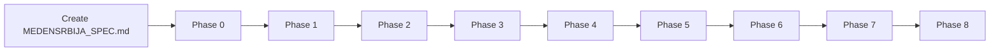

# Medensrbija Next.js Rebuild – Development Plan

## Current state (reconnaissance)

- **Stack:** Next.js 16 (App Router), React 19, Tailwind v4, TypeScript. Styling is already Tailwind; stay consistent.
- **Phase 0:** Partially done. [app/layout.tsx](app/layout.tsx) and [app/page.tsx](app/page.tsx) exist; layout still has boilerplate metadata ("Create Next App") and Geist fonts; page is the CNA placeholder. [app/globals.css](app/globals.css) has Tailwind + CSS variables. Workspace rule: **dark theme**.
- **Assets:** All images exist under `public/images/`: `hero/hero.webp`, `logo/logo.webp`, `aboutus/` (3), `products/` (16), `awards/` (6), `socials/` (4). Reference as `/images/...`; use `next/image` except for CSS backgrounds.

---

## Step 0: Project description file (do first)

Create **one canonical spec file** in the project root so Cursor can reference it in later phases.

- **File:** `MEDENSRBIJA_SPEC.md` (or `PROJECT_SPEC.md`) at project root.
- **Contents:**
  - Project goal (rebuild medensrbija.com, same content structure and business purpose).
  - Global rules: Next.js App Router, Tailwind, images in `/public/images` and paths `/images/...`, `next/image` where possible, no CMS/backend in early phases, static-first until Phase 6+.
  - Brief site structure: Hero → About → Products → Awards → Contact.
  - Phase list (0–9) with one-line goals and main deliverables.
  - Cursor usage: one phase at a time, don’t change previous phases unless asked, assume assets exist, ask before new dependencies.
  - Success criteria: clean modern UI, fast, clear structure, easy to extend.

This file is the single source of truth for “what we’re building”; no need to re-paste the full spec in chat.

---

## Phase 0 – Project setup (finish)

**Goal:** Clean foundation before UI work.

- **Layout:** Update [app/layout.tsx](app/layout.tsx): metadata (title e.g. “Meden Srbija”, description for medensrbija.com), `lang` if needed (e.g. `sr` or `en`), keep or swap to Google Fonts per spec (“Define font system (Google Fonts)”).
- **Page:** Replace [app/page.tsx](app/page.tsx) with an empty placeholder (e.g. minimal fragment or “Meden Srbija” only).
- **Styles:** Keep [app/globals.css](app/globals.css); ensure dark theme and Tailwind are aligned with [.cursor/rules/meden-rules.mdc](.cursor/rules/meden-rules.mdc).

**Deliverables:** Finalized `app/layout.tsx`, `app/page.tsx` (placeholder), `app/globals.css`.

---

## Phase 1 – Layout and navigation

**Goal:** Core site shell.

- **Header:** Logo left ([/images/logo/logo.webp](/images/logo/logo.webp)), nav links right, sticky on scroll, mobile hamburger.
- **Footer:** Business name, contact info, copyright.
- **Structure:** Add `components/` (e.g. `components/Header.tsx`, `components/Footer.tsx`). Compose them in `app/layout.tsx` or `app/page.tsx` as appropriate.

**Deliverables:** `<Header />`, `<Footer />`, responsive behavior.

---

## Phase 2 – Hero section

**Goal:** Strong first impression.

- **Content:** Background (e.g. `/images/hero/hero.webp` or image + gradient), h1, subheadline, CTA button (scroll to products).
- **Design:** Large typography, centered, smooth entrance animation.

**Deliverables:** `<Hero />`, responsive typography.

---

## Phase 3 – About section

**Goal:** Trust and brand story.

- **Content:** Title, short paragraph (tradition/quality), supporting image (e.g. from `/images/aboutus/`).
- **Design:** Two columns on desktop, stacked on mobile.

**Deliverables:** `<About />`.

---

## Phase 4 – Products section

**Goal:** Showcase honey products.

- **Content:** Section title, grid of product cards: image, name, short description, weight variants (static).
- **Data:** Static list keyed to existing assets in `/images/products/` (e.g. BAGREM, LIPA, LIVADA, SUMSKI, etc.).
- **Design:** Card layout, hover effects, responsive grid.

**Deliverables:** `<Products />`, `<ProductCard />`.

---

## Phase 5 – Awards / quality section

**Goal:** Social proof.

- **Content:** Awards images from `/images/awards/`, short credibility text.
- **Design:** Horizontal row or grid, minimal.

**Deliverables:** `<Awards />`.

---

## Phase 6 – Contact section

**Goal:** Easy communication.

- **Content:** Phone, email, address; optional static contact form (no submit logic).
- **Design:** Clean layout; icons allowed (e.g. from `/images/socials/` or inline SVG).

**Deliverables:** `<Contact />`.

---

## Phase 7 – Animations and polish

**Goal:** Modern feel without excess.

- Subtle fade/slide and scroll-based reveals; button hover animations.
- Rules: no over-animation, performance-first (prefer CSS or lightweight lib if any).

---

## Phase 8 – SEO and performance

**Goal:** Production readiness.

- Metadata per section or page where applicable.
- Image optimization (sizes, priority, alt).
- Lighthouse-friendly structure and mobile-first tweaks.

---

## Execution order

Work **one phase at a time**. Do not modify earlier phases unless explicitly requested. When in doubt, open `MEDENSRBIJA_SPEC.md` to confirm scope and rules.
