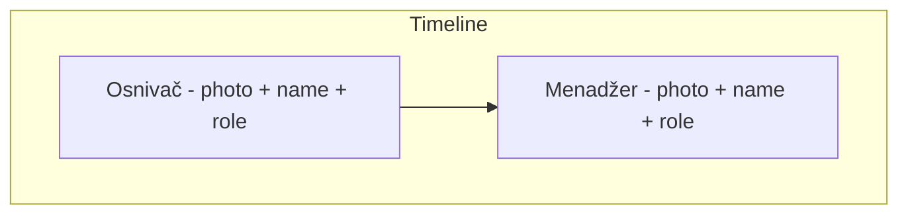

# Team in About Section – Layout Options

## Context

- **Assets:** [public/images/aboutus/osnivac.webp](public/images/aboutus/osnivac.webp) (founder), [public/images/aboutus/menadzer.webp](public/images/aboutus/menadzer.webp) (manager). Reference as `/images/aboutus/osnivac.webp` and `/images/aboutus/menadzer.webp`.
- **Placement:** New block **below** the existing two-column grid (title + paragraphs + main image) inside [components/About.tsx](components/About.tsx), same section `#o-nama`.
- **Rules:** Tailwind only, dark theme, `next/image`, optional `RevealOnScroll` for the new block; no new dependencies. Copy will need labels (e.g. "Osnivač", "Menadžer") and optional short lines — placeholder or your text.

---

## Option A – Vertical timeline

**Idea:** One column with a vertical timeline line; each person is a “node” (photo + name + role + short line). Reads as “story of who’s behind Meden Srbija.”

- **Layout:** Centered column, e.g. `max-w-2xl mx-auto`. A vertical line (e.g. `border-l-2 border-white/20` or gradient) with two nodes. Each node: small circular or rounded photo on the line, then name (e.g. h3), role, optional one-line description.
- **Visual:** Photos can be circles (`rounded-full`) or rounded squares; line connects them. Subtle connector from line to content (e.g. short horizontal bar or dot). Optional: light gradient or glow on the line.
- **Responsive:** Same on mobile; line stays vertical; text stacks under each photo.
- **Pros:** Strong “narrative” feel, clear order (e.g. founder first, then manager). **Cons:** Slightly more markup/CSS for the line and alignment.

---

## Option B – Horizontal card row

**Idea:** Two equal cards side by side (photo on top, name, role, optional one line). Simple and balanced.

- **Layout:** Grid `grid-cols-1 md:grid-cols-2` with gap. Each card: image (aspect ratio e.g. 3/4 or 1/1), then name (h3), role (small label or subtitle), optional short line. Cards can have a light border or background (`bg-white/5`, `border border-white/10`) and hover lift/shadow.
- **Visual:** Consistent card height; images `object-cover` in a fixed aspect box. Typography matches existing About (e.g. `text-[var(--foreground)]`, opacity variants).
- **Responsive:** Stack on mobile (one card per row).
- **Pros:** Easy to implement, clear, scalable if you add more people later. **Cons:** Less “story” than a timeline.

---

## Option C – Alternating story blocks

**Idea:** Two rows: first row = founder (large photo left, text right); second row = manager (text left, large photo right). Feels like a short “meet the team” story.

- **Layout:** Two full-width rows. Row 1: grid 2 cols — left: image (`/images/aboutus/osnivac.webp`), right: heading “Osnivač” (or name), role, 1–2 sentences. Row 2: grid 2 cols — left: heading “Menadžer”, role, 1–2 sentences; right: image (`/images/aboutus/menadzer.webp`). Use same max-width container as current About content.
- **Visual:** Large photos (e.g. aspect 4/5 or 3/4), rounded corners to match current About image. Alternating sides give a zigzag flow. Optional: separate `RevealOnScroll` per row for staggered reveal.
- **Responsive:** On mobile, stack image then text for each person (or text then image to keep alternation).
- **Pros:** Prominent photos, narrative flow. **Cons:** More vertical space; needs a bit more copy for balance.

---

## Comparison

| Criteria       | A – Timeline        | B – Card row         | C – Alternating blocks |
| -------------- | ------------------- | -------------------- | ---------------------- |
| Visual impact  | High (line + nodes) | Medium (clean cards) | High (large photos)    |
| Implementation | Medium              | Easiest              | Medium                 |
| Best for       | “Our story” order   | Quick scan, balance  | “Meet the team” story  |
| Space          | Compact             | Compact              | More vertical          |

---

## Implementation (after you pick)

1. **Add a subsection** inside [components/About.tsx](components/About.tsx) below the current grid: e.g. a subheading “Tim koji stoji iza projekta” (or “Naš tim”) and the chosen layout.
2. **Use `next/image**`for both photos:`fill`or fixed dimensions,`sizes`, descriptive `alt`.
3. **Keep semantics:** e.g. one `<h3>` per person (or role), so heading order stays correct after the section’s h2.
4. **Optional:** Wrap the new block in `RevealOnScroll` for scroll-in animation, reusing existing patterns from [app/globals.css](app/globals.css) or minimal new Tailwind.
5. **Copy:** Use placeholders for names/roles/descriptions (e.g. “Osnivač”, “Menadžer”) unless you provide exact text; you can replace later.

---

## What to choose

Reply with **A**, **B**, or **C** (or a mix, e.g. “B but with a thin timeline line above the cards”). If you want different labels or real names/roles, share them and we’ll use those in the implementation.
